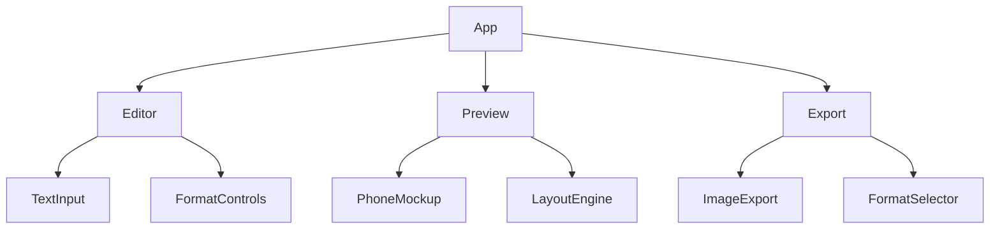
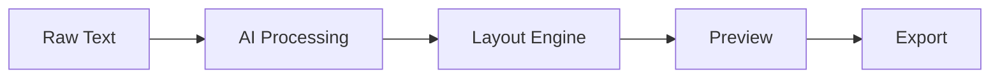
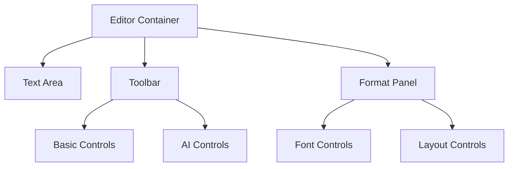
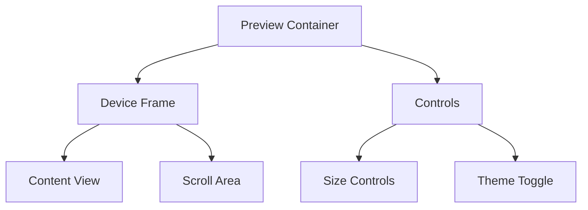
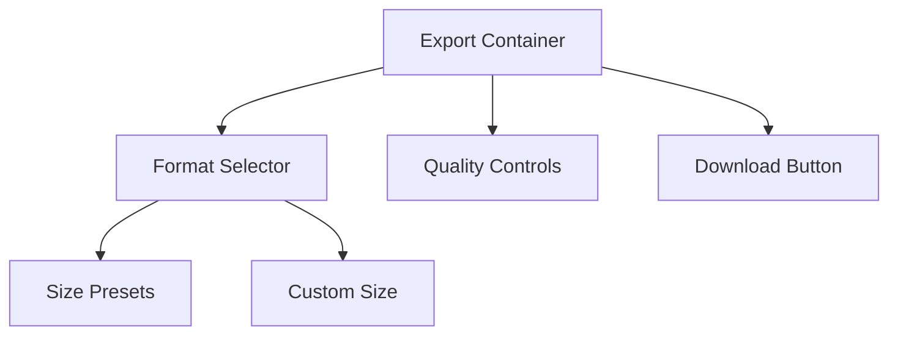

# System Patterns

## Architecture Overview

### Component Architecture


### Data Flow


## Design Patterns

### Component Patterns
1. **Atomic Design**
   - Atoms: Basic UI elements
   - Molecules: Combined UI elements
   - Organisms: Complex components
   - Templates: Page layouts
   - Pages: Full views

2. **Container/Presenter Pattern**
   - Smart containers for logic
   - Dumb components for UI
   - Clear separation of concerns

### State Management
1. **Global State**
   - User preferences
   - Theme settings
   - Export configuration

2. **Local State**
   - Form inputs
   - UI interactions
   - Temporary data

### Layout Patterns
1. **Mobile-First Design**
   - Base styles for mobile
   - Progressive enhancement
   - Responsive breakpoints

2. **Grid System**
   - 12-column layout
   - Flexbox containers
   - CSS Grid areas

## Component Relationships

### Editor Module


### Preview Module


### Export Module


## Code Organization

### Directory Structure
```
src/
├── components/
│   ├── editor/
│   ├── preview/
│   ├── export/
│   └── shared/
├── hooks/
├── utils/
├── styles/
└── types/
```

### Module Boundaries
1. **Editor Module**
   - Text input handling
   - Format controls
   - AI processing

2. **Preview Module**
   - Layout rendering
   - Device simulation
   - Real-time updates

3. **Export Module**
   - Image generation
   - Format handling
   - Download management

## Implementation Patterns

### Error Handling
1. **User Errors**
   - Validation feedback
   - Error messages
   - Recovery options

2. **System Errors**
   - Error boundaries
   - Fallback UI
   - Error logging

### Performance Patterns
1. **Lazy Loading**
   - Component splitting
   - Route-based code splitting
   - Dynamic imports

2. **Caching**
   - AI responses
   - Generated layouts
   - Export results

### Security Patterns
1. **Input Validation**
   - Sanitization
   - Type checking
   - Length limits

2. **API Security**
   - Key management
   - Rate limiting
   - Error masking

## Testing Patterns

### Unit Tests
1. **Component Tests**
   - Rendering
   - User interactions
   - State changes

2. **Utility Tests**
   - Pure functions
   - Helpers
   - Formatters

### Integration Tests
1. **Module Tests**
   - Editor workflow
   - Preview updates
   - Export process

### E2E Tests
1. **User Flows**
   - Content creation
   - Format selection
   - Export completion

## Accessibility Patterns

### Keyboard Navigation
1. **Focus Management**
   - Tab order
   - Focus traps
   - Skip links

2. **Keyboard Shortcuts**
   - Editor controls
   - Preview navigation
   - Export actions

### Screen Readers
1. **ARIA Labels**
   - Dynamic content
   - Interactive elements
   - Status updates

This document will be updated as new patterns emerge and existing ones evolve. 